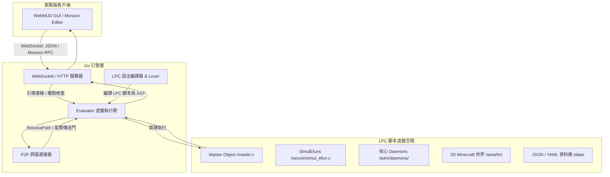

# docs/mudlib/01_architecture.md

# 源流福爾摩沙 — 系統架構設計 (System Architecture)

## 文件定位

本文件定義 《源流福爾摩沙》 MUD 的整體系統架構、元件關係與代碼繼承體系。

本系統採用 **「Go 語言驅動引擎（Driver）＋ LPC 虛擬機器（MUDLib）＋ 現代 Web 前端（WebMUD）」** 的三層架構，並在 LPC 內層實作領域驅動（DDD）與沙盒化 Minecraft 空間。

---

## 1. 整體系統拓撲 (System Topology)



---

## 2. MUDLib 目錄結構與定位

MUDLib 的目錄劃分嚴格對應權限等級與功能職責：

| 目錄路徑 | 權限角色 (UID) | 職責說明 |
|---|---|---|
| **`/secure/`** | `Root` | 最核心安全區。包含系統權限檢驗（`valid.c`）、全域模擬函式（`simul_efun.c`）、事件總線（`event_d.c`）與跨服通信（`fs_d.c`）。 |
| **`/adm/`** | `Root` | 系統管理區。主要存放核心系統 Daemons（如 `timeline_d.c`、`settlement_d.c`、`footprint_d.c`）。 |
| **`/std/`** | `Backbone` | 標準基底類別（Blueprints）。定義所有遊戲內實體的最基礎行為，供其他物件繼承。 |
| **`/cmds/`** | `Backbone` | 玩家與管理員指令集。透過 `command_d.c` 動態加載並執行。 |
| **`/area/`** / **`/world/`** | `Backbone` | 物理與語意世界空間。包含 2D Minecraft 網格世界實體與歷史 Site 實體。 |
| **`/npc/`** / **`/item/`** | `Backbone` | 遊戲內 NPC 與道具模板。 |
| **`/data/`** | `Root` / `User` | 資料儲存區。`/data/yaml/` 存放唯讀設定，`/data/state/` 存放動態 JSON 存檔。 |

---

## 3. LPC 類別繼承體系 (Inheritance Hierarchy)

為了實現高復用性並保證空間與生物行為的標準化，所有 LPC 實體必須繼承自 `/std/` 下的標準基底：

```text
                  ┌────────────────────────┐
                  │      /std/object.c     │  (最基礎物件，管理 ID、屬性與語系)
                  └───────────┬────────────┘
                              │
                  ┌───────────▼────────────┐
                  │    /std/container.c    │  (容器類別，管理內部庫存與物件移入出)
                  └───────────┬────────────┘
                              │
            ┌─────────────────┴─────────────────┐
            ▼                                   ▼
┌───────────────────────┐           ┌───────────────────────┐
│      /std/room.c      │           │     /std/living.c     │ (生物基底，管理心跳與行動)
└───────────┬───────────┘           └───────────┬───────────┘
            │                                   │
┌───────────▼───────────┐           ┌───────────┴───────────┐
│   /area/lm/world.c    │           ▼                       ▼
└───────────────────────┘   ┌───────────────┐       ┌───────────────┐
 (2D Minecraft 網格引擎)      │  /std/user.c  │       │  /std/npc.c   │
                            └───────────────┘       └───────────────┘
                             (玩家連線實體)           (非玩家生物模板)
```

### 核心基底職責說明：
- **`object.c`**：提供 `set()` / `query()` 萬用資料屬性表、多語系選擇（`select_lang`）、物件複製與銷毀事件。
- **`container.c`**：實作 `all_inventory()`、`present()`，並把關 `can_contain()` 安全檢查。
- **`room.c`**：管理物理出口（`exits`）、Site 圍欄、禁止戰鬥標記（`no_combat`）與 NPC 重生點。
- **`living.c`**：啟動心跳機制（`heart_beat`）、管理基本狀態（Stamina/精力、手藝等級等）。

---

## 4. 關鍵互動工作流 (Interaction Workflows)

### 4.1 指令分發工作流 (Command Dispatching)

當玩家在網格中輸入一個指令（例如：`explore station`）：

```text
  [瀏覽器前端]  ──(WS: explore station)──>  [Go Driver (Connection Loop)]
                                                      │
                                           (呼叫 LPC user.c->command())
                                                      │
                                                      ▼
                                            [LPC: /std/user.c]
                                                      │
                                          (轉發給指令守護進程)
                                                      │
                                                      ▼
                                         [LPC: /secure/command_d.c]
                                                      │
                       ┌──────────────────────────────┴──────────────────────────────┐
                       ▼                                                             ▼
             [比對動態 Verb (add_action)]                                 [比對全域 /cmds/ 目錄]
                       │                                                             │
           (呼叫當前 Room 綁定的函式)                                      (加載並執行 /cmds/cmd_explore.c)
                       │                                                             │
                       └──────────────────────────────┬──────────────────────────────┘
                                                      ▼
                                           (執行 main()，寫回結果)
```

---

### 4.2 前後端同步工作流 (JSON Protocol)

本系統完全屏棄了傳統 MUD 的純 ANSI 終端文字流，採用 **「JSON 封包控制 ＋ 文字流備援」** 的混合同步機制。

- **協定標記**：當 Driver 傳送以 `{"ui": ...}` 開頭的 JSON 字串時，前端 WebMUD 會攔截該行，不作為純文字顯示，而是解析為前端 React/Vue UI 組件的渲染資料（如：2D 地圖更新、Toast 提示、Monaco 編輯器內容）。
- **即時地圖同步 (JSON Payload 範例)**：
  ```json
  {"ui": "mc_map", "data": { "width": 60, "height": 40, "blocks": { "30,15": "stone" }, "self_id": "wade" }}
  ```

---

## 5. 安全與權限控制 (Security & Permissions)

為了防止不受信任的腳本越權存取核心存檔或修改關鍵 Daemons，系統基於 **UID (User ID)** 進行多層權限把關。

### 5.1 三大權限角色

1. **`Root`**：最高權限。僅分配給 `/secure/` 與 `/adm/` 目錄下的系統程式碼。具有全域檔案讀寫與調用所有特權 Efun（如 `shutdown`、`exec`）的權限。
2. **`Backbone`**：骨幹權限。分配給標準基底 `/std/`、指令 `/cmds/` 與世界空間 `/area/`。允許讀取大部分代碼，但限制寫入資料庫檔案。
3. **`User / Guest`**：玩家與賓客權限。僅能變更自身暫存屬性，完全被沙盒隔離。

### 5.2 權限把關代理人 (`/secure/valid.c`)

所有的檔案讀寫（`read_file`、`write_file`）與物件加載，都必須通過 `/master.c`（繼承自 `valid.c`）的審查：

```c
// /secure/valid.c
int valid_read(string path, string uid, string func) {
    // 限制：非 Root 權限物件，不可讀取 /secure/ 或 /data/state/user/ 存檔
    if (strsrch(path, "/secure/") == 0 && uid != "Root") return 0;
    return 1;
}

int valid_write(string path, string uid, string func) {
    // 限制：僅有 Root 才能變更 /data/ 下的資料
    if (strsrch(path, "/data/") == 0 && uid != "Root") return 0;
    return 1;
}
```
這種底層權限機制保證了《源流福爾摩沙》龐大小說資料與全服聚落變數的絕對安全。
