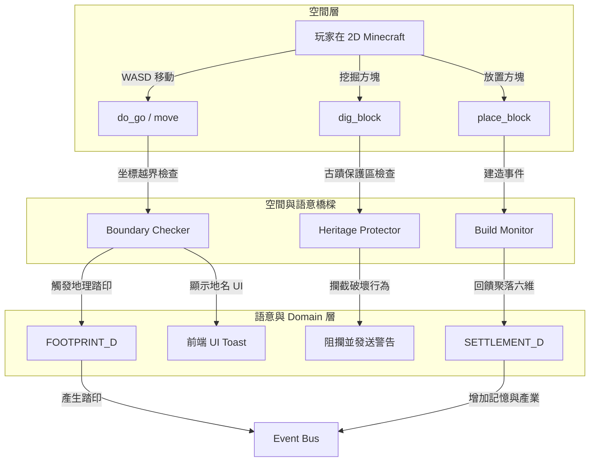

# docs/mudlib/03_world_engine.md

# 源流福爾摩沙 — 空間引擎與語意繫結 (World Engine)

## 文件定位

本文件定義 **2D Minecraft 空間引擎 (`world.c`)** 與 **Domain 語意層 (Site / Settlement)** 之間的雙向繫結與互動機制。

- **空間層 (Spatial Layer)**：由 `world.c` 與相關亞空間管理，負責 2D 網格坐標 `(x, y)`、方塊操作（dig / place）與移動（WASD）。
- **語意層 (Semantic Layer)**：由 Domain 實體（Settlement / Site）管理，負責歷史、文化、聚落六維屬性與記憶共振。

本文件旨在解決：**「玩家在 2D 網格中的物理行為，如何轉化為土地的記憶與歷史踏印？」**

---

## 系統架構圖



---

## 1. 空間與語意繫結模式 (Binding Modes)

為了將物理坐標與歷史文化概念相連，系統支援兩種繫結模式：

### 模式 A：全地圖映射 (Full Map Binding)
適用於**單一 Site** 或**獨立小副本**（例如：晶石廣場、特定小島）。
- 整個 `world.c` 實體代表一個語意物件。
- 在 `world.c` 中直接註冊 `domain_id`。

```c
// 在 /area/lm/center_world.c
void create() {
    ::create();
    set_domain_id("center_world_plaza"); // 指向 Site ID
}
```

### 模式 B：坐標圍欄映射 (Coordinate Boundary Binding)
適用於**大地圖**（例如：整個民雄聚落網格中，包含老車站、打貓石碑、鳳梨田等不同 Site）。
- 透過在 `world.c` 中維護一個圍欄配置表（Coordinate Fence Map）。

```c
// 圍欄結構定義
struct Fence {
    string site_id;      // 對應的 Site ID
    int x_min;
    int x_max;
    int y_min;
    int y_max;
    string enter_msg;    // 進入時的文字提示
}
```

---

## 2. 坐標圍欄檢查器 (Boundary Checker)

當玩家執行移動時，`world.c` 必須主動偵測玩家是否「跨越」了圍欄邊界。

### 越界檢查演算法

每次玩家坐標 `(x, y)` 變更時：
1. 查詢玩家「前一次」所在的 `site_id`（記錄於玩家 temp_data 內，例如 `me->query_temp("current_site")`）。
2. 計算新坐標 `(new_x, new_y)` 落在哪個 `Fence` 範圍內。
3. 若新舊 `site_id` 不同，則觸發**切換事件**：
   - **離域 (Leave)**：呼叫舊 Site 的離開回呼。
   - **入域 (Enter)**：呼叫新 Site 的進入回呼。

### LPC 實作範例

```c
// 在 /std/room.c (或 world.c)
private nosave struct Fence *fences = ({});

void add_fence(string site_id, int x1, int x2, int y1, int y2, string msg) {
    struct Fence f = new(struct Fence);
    f->site_id = site_id;
    f->x_min = x1 < x2 ? x1 : x2;
    f->x_max = x1 > x2 ? x1 : x2;
    f->y_min = y1 < y2 ? y1 : y2;
    f->y_max = y1 > y2 ? y1 : y2;
    f->enter_msg = msg;
    fences += ({ f });
}

string check_site_at(int x, int y) {
    foreach (struct Fence f in fences) {
        if (x >= f->x_min && x <= f->x_max && y >= f->y_min && y <= f->y_max) {
            return f->site_id;
        }
    }
    return 0; // 無特定 Site，屬於聚落公用野外
}

void check_player_movement(object player, int from_x, int from_y, int to_x, int to_y) {
    string old_site = check_site_at(from_x, from_y);
    string new_site = check_site_at(to_x, to_y);

    if (old_site != new_site) {
        if (old_site) {
            // 觸發舊 Site 離域事件
            load_object("/daemon/site_d.c")->on_player_leave(player, old_site);
        }
        if (new_site) {
            // 觸發新 Site 入域事件（內部會發送地理踏印）
            load_object("/daemon/site_d.c")->on_player_enter(player, new_site);
            
            // 通知前端更新地名 Banner
            tell_object(player, sprintf("{\"ui\":\"toast\",\"type\":\"area_enter\",\"title\":\"%s\"}\n", 
                load_object("/daemon/site_d.c")->query_site_name(new_site)
            ));
        }
    }
}
```

---

## 3. 古蹟保護與互動阻攔 (Heritage Protector)

《源流福爾摩沙》核心理念是保護與理解，因此**絕對禁止隨意破壞歷史文化遺產**。

### 保護區判定與行為阻攔

1. **方塊挖掘保護**：
   - 當玩家在 `(x, y)` 執行 `dig` 指令時，`world.c` 會呼叫 `check_site_at(x, y)`。
   - 若該區域對應的 Site 屬性中 `is_heritage == 1`（為歷史保護區），則拒絕挖掘。
   - 阻攔並提示：「$HIR$此處為歷史文化保護區，請尊重島嶼的記憶，不可隨意開挖。$NOR$」。

2. **建設破壞保護**：
   - 當玩家嘗試在保護區內 `place` 現代方塊（如鐵、金、磚塊）時，同樣予以攔截。
   - 僅允許使用「修復性方塊」（如指定的傳統木材或石材，且需持有特定任務）。

### LPC 阻攔實作

```c
// 在 /area/lm/world.c 內的 dig_block 核心邏輯中加入：
int dig_block(object me, int x, int y) {
    string site_id = check_site_at(x, y);
    
    if (site_id) {
        object site_ob = load_object("/daemon/site_d.c")->get_site_object(site_id);
        if (site_ob && site_ob->query("is_heritage")) {
            write("$HIR$警告：此處為「" + site_ob->query("name") + "」保護區，不可進行破壞性挖掘！\n$NOR$");
            return 0; // 阻攔
        }
    }
    
    // ... 原本的挖掘邏輯 ...
}
```

---

## 4. 建設性挖掘與聚落回饋 (Semantic Building Feedback)

在非保護區，玩家的物理建造（Place）與挖掘（Dig）不只是純粹的沙盒遊戲，而是**聚落建設**的一部分。

### 行為與數值回饋對照表

| 玩家行為 | 發生區域 | 消耗資源 | 對應聚落影響 (Settlement Metrics) |
|---|---|---|---|
| **開墾荒地** (挖掉草地/泥土) | 聚落公用區 | 體力 -5 | 農業開發值 +1 |
| **開採煤礦/鐵礦** | 礦坑 Site | 體力 -10 | 產業值 (Industry) +2 |
| **鋪設木質地板/道路** | 聚落規劃區 | Planks 方塊 -1 | 基礎建設值 (Culture/凝聚力) +1 |
| **修復古厝牆面** | 歷史 Site | 磚塊 -1, 技藝踏印 | 記憶值 (Memory) +5, 文化度 (Culture) +3 |

### 聚落更新觸發器

```c
// 在 /area/lm/world.c 放置方塊成功後呼叫：
void post_place_block(object player, int x, int y, string block_type) {
    string domain_id = query_domain_id(); // 取得當前世界繫結的聚落或 Site
    if (!domain_id) return;

    // 若放置的是建設性方塊
    if (block_type == "planks" || block_type == "brick") {
        // 通知 SETTLEMENT_D 增加基礎建設文化度
        SETTLEMENT_D->add_culture(domain_id, 1);
        tell_object(player, "$HIG$你在此處鋪設了建材，為聚落的發展貢獻了 1 點文化影響力！\n$NOR$");
    }
}
```

---

## 5. 歷史多重影分身：時間層疊網格 (Time-Layered Grid)

Canon 核心設定：**「台灣是被時間層疊的島嶼，玩家可透過結晶回到過去。」**

### 設計方案：一地多時空

同一個聚落的地理坐標（如民雄），在不同的 Era（時代）擁有不同的 `world.c` 實體。

```
                    ┌─────────────────────────┐
                    │ TIMELINE_D --時代管理員   │
                    └────────────┬────────────┘
                                 │
         ┌───────────────────────┼───────────────────────┐
         ▼                       ▼                       ▼
   v0.2 海商紀             v1.9 乙未之殤           v4.0 現代福爾摩沙
┌─────────────────┐     ┌─────────────────┐     ┌─────────────────┐
│ /area/lm/       │     │ /area/lm/       │     │ /area/lm/       │
│ minxiong_v02.c  │     │ minxiong_v19.c  │     │ minxiong.c      │
└─────────────────┘     └─────────────────┘     └─────────────────┘
 [荒野、平埔族聚落]       [竹圍、抗日戰壕、火光]     [現代老車站、鳳梨田]
```

### 讀取機制

當玩家使用記憶結晶進入歷史事件時：
1. 系統不載入現代版 `/area/lm/minxiong.c`，而是根據 Era 加載對應版本的 `/area/lm/minxiong_v19.c`。
2. 歷史版的方塊佈局（blocks）不同，Site 圍欄也不同（例如：乙未之殤版本中，老車站會變成防線陣地 Site，且 `is_heritage` 為 0，允許戰鬥或戰略放置防禦方塊）。

---

## 6. 前後端即時同步協定 (Client Synchronization)

當空間引擎與語意層互動時，前端地圖渲染器（WebMUD UI）需同步展現狀態。

### 同步 Payload 擴充項目 (JSON)

```json
{
  "ui": "mc_map",
  "data": {
    "world_name": "民雄 (乙未之殤)",
    "current_site": "minxiong_barricade",
    "site_status": {
      "is_protected": false,
      "zone_name": "抗日防線竹圍"
    },
    "blocks": {
      "42,7": "planks"
    }
  }
}
```
當 `current_site` 改變時，前端客戶端會自動在頂部欄更換「目前所在地」與對應的配樂背景音，達成無縫的沉浸式體驗。
