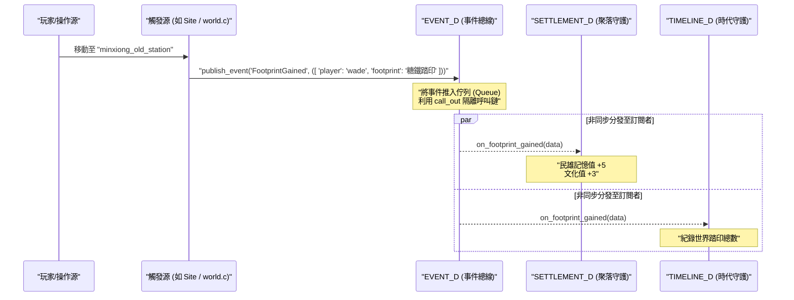

# docs/mudlib/04_event_system.md

# 源流福爾摩沙 — 非同步事件總線系統 (Event Bus System)

## 文件定位

本文件定義 **MUDLib 核心事件總線 (`event_d.c`)** 的架構與訂閱機制。

根據 [docs/mudlib/02_domain_model.md](file:///home/wade/src/github/FormosaSaga/docs/mudlib/02_domain_model.md#L27-L39) 的核心設計原則：
> **台灣是中小企業、地方主義，刻意迴避中央集權的 Manager 模式。每個 Aggregate（聚落、時代、玩家、踏印）自己管理自己的狀態。**

為了在無集權管理者的前提下實現跨領域協調，本系統採用**事件驅動架構 (Event-Driven Architecture, EDA)**。所有跨 Aggregate 的通知均透過 `/secure/event_d.c` 進行非同步分發。

---

## 系統流向圖



---

## 1. 核心事件規格定義 (Domain Events)

事件本體在 LPC 中以 `mapping` (或自定義 `class`) 表達，至少包含：
- `event_id`: 全域唯一 UUID
- `event_type`: 事件類型字串
- `timestamp`: 觸發時間戳記
- `data`: 事件主體負載 (Payload mapping)

### 第一階段 (M1) 核心事件清單

```c
// 1. 獲得踏印事件
// Event Type: "FootprintGained"
mapping footprint_event = ([
    "player_id"    : "wade",
    "footprint_id" : "sugar_railway_minxiong",
    "category"     : "geography", // 地理踏印
    "value"        : 5            // 回饋權重
]);

// 2. 聚落數值變更事件
// Event Type: "SettlementChanged"
mapping settlement_event = ([
    "settlement_id": "minxiong",
    "field"        : "memory",    // 變更欄位：memory / culture / population
    "old_value"    : 35,
    "new_value"    : 40
]);

// 3. 時代翻頁事件
// Event Type: "EraShifted"
mapping era_event = ([
    "from_era"     : "v0.2_sea_merchants",
    "to_era"       : "v1.0_early_qing",
    "trigger_by"   : "minxiong"   // 觸發翻頁的關鍵聚落
]);
```

---

## 2. 事件總線守護進程 (/secure/event_d.c)

`/secure/event_d.c` 負責維護全服的訂閱名單，並執行事件的分發。

### 訂閱機制設計

為了避免記憶體洩漏與無效指針，`EVENT_D` 不直接保存物件引用，而是保存**物件路徑檔名 (object_name)**。在分發時，動態進行 `find_object` 或 `load_object`。

### 核心 LPC 原始碼實作

```c
// /secure/event_d.c
#include "/include/ansi.h"

inherit "/std/object";

// 訂閱表結構：([ "event_type": ({ ([ "ob_path": "/daemon/...", "func": "callback" ]) }) ])
private nosave mapping subscriptions;

// 非同步事件佇列
private nosave mixed *event_queue;
private nosave int is_dispatching;

void create() {
    ::create();
    subscriptions = ([]);
    event_queue = ({});
    is_dispatching = 0;
}

// =====================================================================
// API 1: 註冊訂閱
// =====================================================================
void subscribe(string event_type, string callback_func) {
    object ob = previous_object();
    if (!ob) return;
    
    string ob_path = base_name(ob);
    
    if (!subscriptions[event_type]) {
        subscriptions[event_type] = ({});
    }

    // 避免重複訂閱
    foreach (mapping sub in subscriptions[event_type]) {
        if (sub["ob_path"] == ob_path && sub["func"] == callback_func) {
            return; 
        }
    }

    subscriptions[event_type] += ({ ([
        "ob_path" : ob_path,
        "func"    : callback_func
    ]) });
}

// =====================================================================
// API 2: 取消訂閱
// =====================================================================
void unsubscribe(string event_type) {
    object ob = previous_object();
    if (!ob || !subscriptions[event_type]) return;

    string ob_path = base_name(ob);
    mapping *new_subs = ({});

    foreach (mapping sub in subscriptions[event_type]) {
        if (sub["ob_path"] != ob_path) {
            new_subs += ({ sub });
        }
    }
    subscriptions[event_type] = new_subs;
}

// =====================================================================
// API 3: 發布事件 (非同步排程)
// =====================================================================
void publish(string event_type, mapping data) {
    // 封裝標準事件外殼
    mapping event = ([
        "event_id"   : sprintf("%d_%d", time(), random(100000)),
        "event_type" : event_type,
        "timestamp"  : time(),
        "data"       : data
    ]);

    // 推入佇列
    event_queue += ({ event });

    // 啟動非同步分發循環 (延遲至下一個 heart_beat tick 執行，隔離執行鏈)
    if (!is_dispatching) {
        is_dispatching = 1;
        call_out("dispatch_loop", 0);
    }
}
```

---

## 3. 非同步與錯誤隔離機制 (Error Isolation)

> [!IMPORTANT]
> **非同步分發**是維持 MUD 穩定度的關鍵。
> 如果某個聚落或房間的 LPC 程式碼在事件處理常式中崩潰（例如除以零或 null pointer），此錯誤**絕對不能**中斷主執行鏈（例如玩家正在進行的操作）或其他訂閱者的接收。

### 佇列分發與沙盒隔離實作

在 `EVENT_D` 中使用 `dispatch_loop` 配合 `catch` 來執行安全分發：

```c
// /secure/event_d.c 續
private void dispatch_loop() {
    if (sizeof(event_queue) == 0) {
        is_dispatching = 0;
        return;
    }

    // 取出佇列頭部事件
    mapping event = event_queue[0];
    event_queue = event_queue[1..];

    string event_type = event["event_type"];
    mapping *subs = subscriptions[event_type];

    if (subs && sizeof(subs) > 0) {
        foreach (mapping sub in subs) {
            // 動態載入/尋找訂閱物件
            object target = find_object(sub["ob_path"]);
            if (!target) {
                // 如果物件被銷毀或尚未加載，嘗試重新加載
                catch(target = load_object(sub["ob_path"]));
            }

            if (target) {
                // 🚀 使用 catch 進行沙盒隔離，防止單一訂閱者錯誤毀滅全服事件處理
                mixed err = catch(call_other(target, sub["func"], event));
                if (err) {
                    // 寫入系統 Error Log
                    log_file("event_errors.log", sprintf(
                        "[%s] Event Type: %s Target: %s Error: %s\n",
                        ctime(time()), event_type, sub["ob_path"], to_string(err)
                    ));
                }
            }
        }
    }

    // 繼續分發下一個事件
    if (sizeof(event_queue) > 0) {
        call_out("dispatch_loop", 0);
    } else {
        is_dispatching = 0;
    }
}
```

---

## 4. 具體應用場景範例：民雄踏印與聚落升級

以下展示當一個玩家在空間中前進，獲得踏印後，事件如何在系統中傳導：

### 步驟 A: 踏印產生
玩家在網格上走到老車站，觸發 `FOOTPRINT_D` 判定：

```c
// /adm/daemons/footprint_d.c
void add_footprint(object player, string footprint_id) {
    // ... 判定防刷機制 ...
    
    // 寫入玩家存檔
    player->add_footprint_record(footprint_id);
    
    // 向總線發送事件
    load_object("/secure/event_d.c")->publish("FootprintGained", ([
        "player_id"    : player->get_id(),
        "footprint_id" : footprint_id,
        "category"     : "geography"
    ]));
}
```

### 步驟 B: 訂閱事件
聚落守護進程在初始化時註冊訂閱：

```c
// /adm/daemons/settlement_d.c
void create() {
    // 訂閱 "FootprintGained" 事件，並指定由 on_footprint 接收
    load_object("/secure/event_d.c")->subscribe("FootprintGained", "on_footprint");
}

// 事件接收回呼
void on_footprint(mapping event) {
    mapping data = event["data"];
    string fid = data["footprint_id"];
    
    // 解析該踏印對應的聚落
    string settlement_id = query_settlement_by_footprint(fid);
    if (!settlement_id) return;
    
    // 增加聚落記憶值與文化值
    add_memory(settlement_id, 5);
    add_culture(settlement_id, 3);
    
    // 更新完畢後，再次發送 SettlementChanged 事件
    load_object("/secure/event_d.c")->publish("SettlementChanged", ([
        "settlement_id" : settlement_id,
        "changes"       : ([ "memory": 5, "culture": 3 ])
    ]));
}
```

### 步驟 C: 版本與時代翻頁
時代守護進程監聽聚落變動事件：

```c
// /adm/daemons/timeline_d.c
void create() {
    load_object("/secure/event_d.c")->subscribe("SettlementChanged", "on_settlement_changed");
}

void on_settlement_changed(mapping event) {
    mapping data = event["data"];
    string sid = data["settlement_id"];
    
    // 檢查全島聚落的記憶與文明總分是否超過閾值
    if (check_world_progress() >= 100) {
        // 進入下一個時代
        next_era();
    }
}
```
透過這種架構，`FOOTPRINT_D` 不需要知道 `SETTLEMENT_D` 的存在；`SETTLEMENT_D` 也不需要知道 `TIMELINE_D` 的邏輯。所有模組皆透過 `EVENT_D` 非同步交換狀態，保持高擴充性與穩定度。
