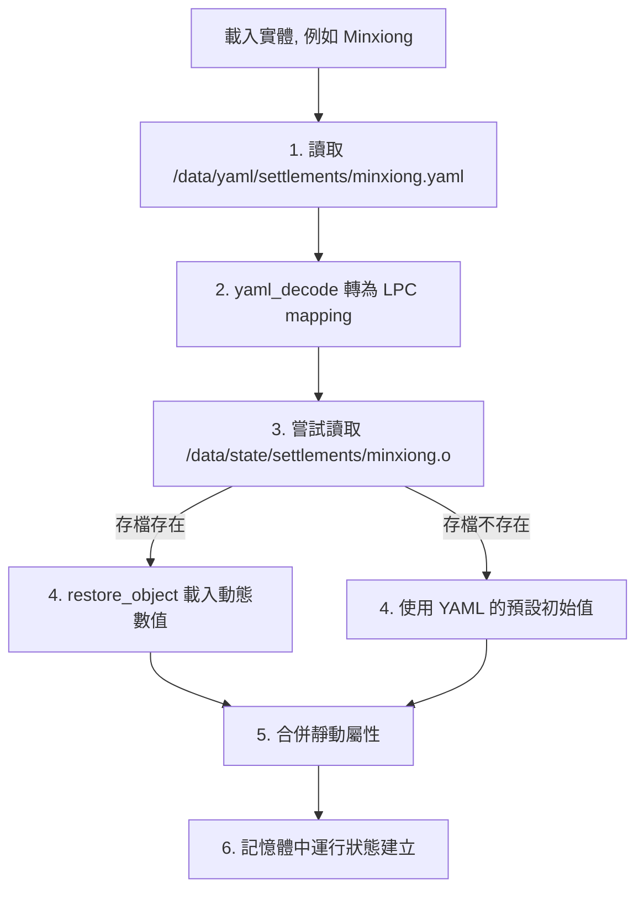

# docs/mudlib/05_data_storage.md

# 源流福爾摩沙 — 資料與混合儲存策略 (Data Storage Strategy)

## 文件定位

本文件定義 MUDLib 中的資料分類、存取管道與儲存週期。

為了承載小說高達 **6卷600章、180萬字以上** 的龐大世界觀設定，同時兼顧玩家在遊戲中建造與探索的動態變更，系統採用 **「靜態 YAML ＋ 動態 JSON」** 的雙軌儲存策略。

- **靜態資料 (Static Canon)**：只讀、時間序設定、聚落元數據、歷史事件劇本。使用 **YAML** 格式，方便策劃與作家直接維護。
- **動態資料 (Dynamic State)**：玩家踏印記錄、聚落六維即時變動值、世界當前時代進度。使用 **JSON (.o 檔)** 格式，由直譯器引擎 `save_object()` 與 `restore_object()` 原生高效存取。

---

## 1. 資料目錄結構規範

```text
/data/
├── yaml/                         <-- 靜態設定檔（僅唯讀，由 yaml_decode 載入）
│   ├── eras/                     <-- 歷史時期設定 (v0_1.yaml, v0_2.yaml, ...)
│   ├── settlements/              <-- 全島聚落初始設定 (minxiong.yaml, tainan.yaml, ...)
│   ├── sites/                    <-- 各地標與景點定義 (minxiong_old_station.yaml, ...)
│   └── memories/                 <-- 600章歷史小說故事片段與解鎖劇本
│
└── state/                        <-- 動態存檔檔（由 save_object / restore_object 管理）
    ├── user/                     <-- 玩家個人存檔 (<player_id>.o)
    ├── system/                   <-- 全服全域狀態 (timeline.o)
    └── settlements/              <-- 各聚落動態變動六維與關係表 (<settlement_id>.o)
```

---

## 2. YAML ↔ LPC 型態映射規則

當 LPC 呼叫 `yaml_decode(read_file(path))` 時，Go 引擎會將 YAML 轉換為 LPC 對應型別：

| YAML 原始型態 | LPC 對應型態 | 轉換範例與說明 |
|---|---|---|
| **Mapping** (鍵值對) | `mapping` | `name: "民雄"` ➡️ `([ "name": "民雄" ])` (鍵值強制為字串) |
| **Sequence** (陣列列表) | `mixed *` (Array) | `- "鳳梨"\n- "糖業"` ➡️ `({ "鳳梨", "糖業" })` |
| **String** (字串) | `string` | `"Lukang"` ➡️ `"Lukang"` (支援 UTF-8 中文) |
| **Integer** (整數) | `int` | `1200` ➡️ `1200` |
| **Float** (浮點數) | `float` | `3.14` ➡️ `3.14` |
| **Boolean** (布林值) | `int` (0 或 1) | `enabled: true` ➡️ `map["enabled"] == 1` |
| **Null** (空值) | `0` (或 `nil`) | `parent: null` ➡️ `0` |

---

## 3. 實體填充模式 (Entity Hydration Pattern)

> [!IMPORTANT]
> **「靜動分離，重啟生效」原則**：
> 為了避免「靜態設定修改後，舊存檔無法同步更新」的傳統 MUD 弊端，存檔 `(.o)` 中**絕對不可**備份靜態 YAML 的內容（例如聚落名稱、介紹文字等）。
> 系統採用 **Entity Hydration (實體填充)**：每次加載實體時，動態合併「靜態定義」與「動態數值」。

### 運作流程圖



---

## 4. LPC 實作範例

以下以聚落守護進程的載入與存檔邏輯為例，展示實體填充模式：

### 聚落加載與合併邏輯 (`settlement_d.c`)

```c
// /adm/daemons/settlement_d.c
#include "/include/ansi.h"

inherit "/std/object";

// 記憶體中的即時狀態：([ "settlement_id": runtime_mapping ])
private nosave mapping active_settlements;

void create() {
    ::create();
    active_settlements = ([]);
}

// 取得或加載聚落實體
mapping load_settlement(string id) {
    if (active_settlements[id]) {
        return active_settlements[id];
    }

    string yaml_path = sprintf("/data/yaml/settlements/%s.yaml", id);
    string save_path = sprintf("/data/state/settlements/%s", id); // 不加 .o

    // 1. 載入靜態設定
    if (file_size(yaml_path) <= 0) {
        log_file("storage_errors.log", "找不到聚落 YAML 設定: " + yaml_path + "\n");
        return 0;
    }
    
    string yaml_content = read_file(yaml_path);
    mapping static_data = yaml_decode(yaml_content);
    if (!static_data) {
        log_file("storage_errors.log", "YAML 解析失敗: " + yaml_path + "\n");
        return 0;
    }

    // 2. 初始化執行期狀態（以靜態資料為底）
    mapping runtime_data = copy(static_data);

    // 3. 嘗試融合動態存檔
    if (file_size(save_path + ".o") > 0) {
        // 建立臨時物件載入動態資料，以避免干擾 Daemon 本身的變數
        object helper = clone_object("/std/object.c");
        if (helper) {
            // 載入 JSON
            if (helper->restore_object(save_path)) {
                // 將存檔內的動態欄位覆蓋至執行期狀態
                runtime_data["population"] = helper->query("population");
                runtime_data["memory"]     = helper->query("memory");
                runtime_data["culture"]    = helper->query("culture");
                runtime_data["trade"]      = helper->query("trade");
                runtime_data["cohesion"]   = helper->query("cohesion");
            }
            destruct(helper);
        }
    } else {
        // 若無存檔，代表首次啟用，使用 YAML 定義的初始值，並立即存檔一次
        save_settlement_state(id, runtime_data);
    }

    active_settlements[id] = runtime_data;
    return runtime_data;
}

// 儲存聚落動態變更
int save_settlement_state(string id, mapping data) {
    string save_path = sprintf("/data/state/settlements/%s", id);
    object helper = clone_object("/std/object.c");
    
    if (!helper) return 0;

    // 僅設定需要持久化的動態指標，絕不存入 name, desc 等靜態內容
    helper->set("population", data["population"]);
    helper->set("memory",     data["memory"]);
    helper->set("culture",    data["culture"]);
    helper->set("trade",      data["trade"]);
    helper->set("cohesion",   data["cohesion"]);

    // 高效存入 JSON
    int success = helper->save_object(save_path);
    destruct(helper);
    
    return success;
}
```

---

## 5. 唯讀與變動的界線判定 (Mutability Boundaries)

為了防止寫入程式碼時不小心修改到靜態設定，請遵循以下原則：

1. **靜態快取唯讀**：
   - 所有透過 `yaml_decode` 直接解碼出的 Mapping，在 LPC 中應被視為**唯讀 (Immutable)**。
   - 若要進行修改，必須使用 `copy()` 複製一份副本。
2. **存檔範圍限制**：
   - 玩家實體（`player.c`）在斷線或定時存檔時，其 `save_object` 只存入個人狀態（如「已獲得的踏印 ID 陣列」、「進行中的劇本 ID」），**絕對不存入**踏印的具體描述與效果。
   - 時代狀態（`timeline_d.c`）只儲存目前運行的 `current_era_id` 與全服累積的文明度數值，不儲存各時代的事件列表。

### 玩家存檔結構對照 (JSON 展現)

```json
{
  "name": "wade",
  "footprints": [
    "sugar_railway_minxiong",
    "Lukang_woodcarving"
  ],
  "timeline_progress": {
    "active_era": "v0.2_sea_merchants",
    "unlocked_memories": [
      "story_chapter_12"
    ]
  }
}
```
*說明：即使未來 `sugar_railway_minxiong` 踏印的文字敘述與文化加成在 YAML 中被修改，該玩家的存檔不受影響，重新登入時將自動載入全新的 YAML 設定。*
