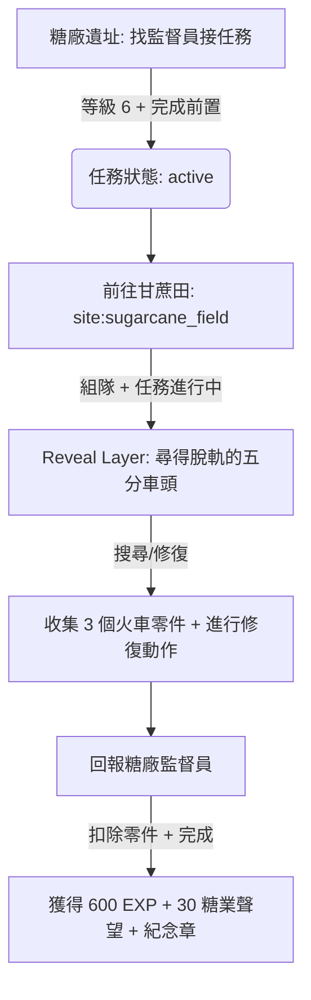

# 糖業勢力任務設計提案：糖鐵搶修委託 (Sugar Railway Emergency Repair)

本提案以首個已完成的 **「廟委鎮煞委託」** 為技術與企劃模板，設計下一個勢力派系任務：**「糖鐵搶修委託」**，用以深化「糖業」勢力的玩法、聲望影響力以及「匠人」職涯的聯動。

---

## 🎯 任務基本資訊 (Quest Metadata)

- **任務 ID**: `sugar_railway_repair`
- **任務名稱**: 
  - `zh-TW`: "糖鐵搶修委託"
  - `en`: "Sugar Railway Emergency Repair"
- **發接任務 NPC**: 糖廠監督員 (Sugar Mill Overseer) at `sugar_factory_ruins` (糖廠遺址)
- **接取限制 (Prerequisites)**:
  - 等級需求：`6` 級以上。
  - 前置任務：需完成 `temple_exorcism` (廟委鎮煞委託) 及新手任務。
  - 特殊職能（可選）：持有「匠人」職涯 (Craftsman Track) 或隊伍中包含匠人可獲得額外對話/簡化修復判定。
- **任務目標 (Goal)**:
  - 收集 3 個「火車零件」並對脫軌的五分車頭執行修復動作。
- **任務獎勵 (Reward)**:
  - 經驗值 (EXP): `600` 點。
  - 金幣 (Gold): `250` 銅幣。
  - 勢力聲望: 「糖業公司」聲望增加 `30` 點。
  - 獎勵道具: 「台糖五分車紀念章」(`/item/sugar_rail_medal.c`，配戴後小幅提升載重或匠人修煉效率)。

---

## 🗺️ 任務執行流程 (Gameplay Flow)



### 1. 接取任務
玩家前往「糖廠遺址」，在該地標向 **糖廠監督員** 詢問任務。若滿足前置條件，任務狀態變更為 `active`。

### 2. 探索秘境與 Reveal Layer
玩家與隊友組隊，移動至鄰近的地標 **「甘蔗田」(`sugarcane_field`)**。
當滿足 `has_quest: active` 與 `in_party` 條件時，甘蔗田地標將動態浮現隱蔽的 Reveal Layer 文字：
> **【線索顯現】** 你們在茂密的甘蔗林深處，發現了一段廢棄且鏽蝕的鐵軌，一輛翻覆的小型五分車蒸汽蒸汽火車頭被壓在泥土與雜草中，車軸處卡著幾塊破碎的零件。

### 3. 收集與修復機制
玩家必須在該處進行探索或完成互動，收集 3 個散落的 **「火車零件」(`train_part`)**，並在背包中持有它們。

### 4. 交付任務
返回「糖廠遺址」向監督員回報，扣除零件，發放經驗值、金錢、糖業勢力聲望，並獲得「五分車紀念章」。

---

## 🛠️ 開發實作配置對照表 (Implementation Spec)

### 1. 任務 YAML 定義 `/world/quests/sugar_railway_repair.yaml`
```yaml
id: "sugar_railway_repair"
name:
  zh-TW: "糖鐵搶修委託"
  en: "Sugar Railway Emergency Repair"
desc:
  zh-TW: "糖廠的運蔗五分車在林間翻覆，導致鐵道運輸中斷。你必須前往甘蔗林，收集 3 個散落的火車零件並排除路障。"
  en: "A sugarcane transport train derailed in the fields. Head into the sugarcane fields, retrieve 3 train parts, and clear the tracks."
level: 6
prereq_quests:
  - temple_exorcism
goal:
  type: "item"
  target: "train_part"
  count: 3
reward:
  exp: 600
  gold: 250
  item: "/item/sugar_rail_medal.c"
  faction:
    id: "sugar_mill_corporation"
    reputation: 30
```

### 2. 地標 YAML 修改 `/data/yaml/sites/minxiong/sugarcane_field.yaml`
新增對應的 `reveal_layers`：
```yaml
reveal_layers:
  - condition: all
    checks:
      - type: has_quest
        quest_id: sugar_railway_repair
        status: active
      - type: in_party
    text: "$HIY$【線索顯現】你們在茂密的甘蔗林深處，發現了一輛翻覆的小型五分車蒸汽火車頭，車軸處卡著幾塊破碎的零件。$NOR$"
```

### 3. 測試腳本開發 `/tests/test_sugar_railway_repair.c`
依據 `test_temple_exorcism.c` 架構，實作完整自動化流程斷言：
1. 驗證未完成 `temple_exorcism` 時無法接受任務（前置鎖定）。
2. 模擬完成前置後成功接取任務。
3. 測試在 `sugarcane_field`地標時，單人看不到線索、組隊後能看到 Reveal Layer 線索。
4. 驗證放入 3 個 `train_part` 背包物品後，呼叫 `complete_quest` 扣除零件並發放聲望與徽章。
5. 斷言玩家的 `sugar_mill_corporation` 聲望增加 `30`。
