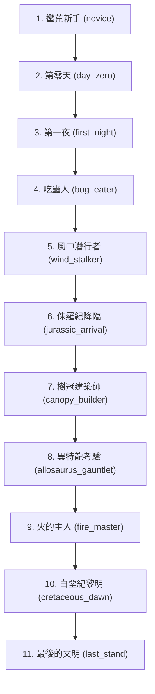

# 《史前文明》(PC) 關卡開發與演進手冊 (Stages Developer Manual)

本手冊為未來開發者提供《史前文明》模組中各個進度階段（Stage）的設計哲學、通關物理規則、關聯因子（Factors）以及相應的氛圍故事。

---

## 總覽：文明演進的十個階段

---

## 設計核心：無戰鬥系統（No Combat System）

未來開發者在開發任何階段的生物與威脅時，**必須遵循 ADR-0008 的核心設計決定：不使用傳統戰鬥系統**。

1. **禁用傳統戰鬥指令**：系統徹底停用了 `kill` 和 `attack` 指令。玩家無法藉由赤手空拳或刷數值（如等級、HP、ATK、DEF）來與史前巨獸正面交鋒。
2. **環境偵測實體模型（Environmental Detection Model）**：PC 中的掠食者（如赫氏翼龍、異特龍、霸王龍）不是戰鬥物件，而是「會移動的環境危害」。牠們的威脅性完全取決於**玩家的「感官狀態與認知因子」**：
   * **未解鎖/未應用對應因子**（例如站在上風處、劇烈走動） ➔ 觸發偵測 ➔ 直接扣減生命值（致死）、強行退回上一個節點並觸發 `Confusion` (困惑)。
   * **正確應用對應因子**（例如利用逆風 `hide downwind`、保持完全靜止 `freeze`） ➔ 規避偵測 ➔ 安全繞行或進一步交互。
3. **對抗熵增的發現驅動**：玩家的成長體現在「對物理世界的規律理解」（解鎖 Factors），而不是數字堆疊。如果玩家可以直接用數值蠻幹打死怪物，那麼對風向、溫度、地表震動的探索就會失去意義。

---

## 關卡詳解

### Stage 1: `novice` — 蠻荒新手
> **故事**：
> 「你在一片焦紅的乾硬荒原上醒來。天空中翻滾著鐵鏽色的厚重雲層，每一次呼吸都像是胸口壓著大石。遠方的地平線下，高大的蕨類森林在熱浪中折射出扭曲的幻影。你一無所有，但生存的本能催促著你踏出第一步。」
*   **出生/復活點**：`/rooms/triassic_plains/room` (三疊紀荒原)
*   **核心目標**：學會鑽木取火、打製石刃、解讀壁畫並穿越捕食者峽谷。
*   **關鍵因子**：`thermodynamics` (引火熱力學)、`flint_knapping` (打製石刃)、`wind_direction` (風向認知)、`stealth_camouflage` (隱蔽偽裝)。
*   **通關任務**：`first_escape` (逆風隱蔽繞過赫氏翼龍)。

---

### Stage 2: `day_zero` — 第零天（三疊紀初期）
> **故事**：
> 「跨出峽谷的瞬間，熱浪如滾燙的鐵板迎面拍來。大氣溫度攀升至 55°C，紅砂岩地表呈現刺眼的焦褐色。大腦在 6 倍於現代濃度的二氧化碳中發出爆裂般的劇痛。站立奔跑只會加速缺氧昏厥，觸摸岩石會瞬間灼傷。你必須在力竭前，找到能夠庇護你的陰影。」
*   **出生/復活點**：`/rooms/desert_canyon/room` (乾燥峽谷)
*   **核心目標**：在極度酷熱與低氧環境下維持體溫，尋找岩壁陰影。
*   **關鍵因子**：`oxygen_scarcity` (低氧限制)、`heat_regulation` (地表熱調節)、`co2_toxicity` (二氧化碳毒性)。
*   **通關任務**：`survive_day_zero` (在背光岩壁陰影下建立初步避難所)。

---

### Stage 3: `first_night` — 第一夜（三疊紀夜間）
> **故事**：
> 「黑暗像潮水一樣吞沒了峽谷。白天的 55°C 高溫消退，取而代之的是透骨的 5°C 寒風。黑暗的碎石中不時傳來硬質甲殼摩擦的沙沙聲。你必須將白天的火種引燃，在寒夜中用火光與熱量築起防線，防禦低溫與暗處窺視的巨蟲。」
*   **出生/復活點**：`/rooms/triassic_shade/room` (背光洞窟陰影)
*   **核心目標**：引燃溫暖的營火以防止失溫死亡。
*   **關鍵因子**：`thermodynamics` (熱量維持)。
*   **通關任務**：`first_fire` (在避難所內生起穩定營火)。

---

### Stage 4: `bug_eater` — 吃蟲人（三疊紀中期）
> **故事**：
> 「極度的飢渴將你逼向崩潰邊緣。三疊紀沒有甘甜的史前果實，只有長滿毒刺的蕨葉。渾濁的河水裡翻滾著藍綠色的藍藻毒素，直接飲用等同於自殺。你將目光投向了那些體長一公尺、背部泛著紅黑色警戒色的巨蜈蚣與低飛的巨蜻蜓。這是一場高蛋白但致命的獵捕。」
*   **出生/復活點**：`/rooms/triassic_shade/room` (背光洞窟陰影)
*   **核心目標**：掌握「石煮法 (Stone Boiling)」淨化有毒河水，捕獵巨型節肢動物，並烤熟食用。
*   **關鍵因子**：`water_boiling` (沸水淨化)、`arthropod_warning` (節肢動物警戒色)、`arthropod_nutrition` (昆蟲蛋白質領悟)。
*   **通關任務**：`first_meal` (飲用煮沸水並食用烤熟的昆蟲肉)。

---

### Stage 5: `wind_stalker` — 風中潛行者（三疊紀後期）
> **故事**：
> 「一隻小型的草食恐龍在溪水邊警惕地飲水，下一秒，一道紅褐色的閃電從灌木叢中射出，尖銳的利齒瞬間咬斷了牠的喉嚨。那是赫氏翼龍。牠聳了聳鼻子，開始在空氣中尋找你的氣味。你緊貼地表，讀取著地面傳來的微弱低頻震動，順著風向緩步退後。」
*   **出生/復活點**：`/rooms/predator_canyon/room` (捕食者峽谷)
*   **核心目標**：學會透過地面震動讀取巨獸體型，利用逆風和泥土掩蓋自身氣味。
*   **關鍵因子**：`vibration_translation` / `vibration_reading` (地表震動讀取)、`predator_scent` (捕食者氣味特徵)。
*   **通關任務**：`first_escape` (成功潛行穿過掠食者峽谷)。

---

### Stage 6: `jurassic_arrival` — 侏羅紀降臨（時代轉換）
> **故事**：
> 「空氣變得濕潤而溫暖，滿眼是高聳入雲的巨型針葉林與銀杏樹。然而地表並非安全之所，小山一般的梁龍踱步而過，沉重的踩踏隨時會將你化為肉泥，且地面的傷口在極度潮濕中極易感染。你必須將藤蔓擰成強韌的繩索，製作出抓鉤，向更安全的高聳樹冠層出發。」
*   **出生/復活點**：`/rooms/jurassic_valley/room` (侏羅紀河谷)
*   **核心目標**：採集堅韌纖維，編織抓鉤攀爬至桫欏樹冠。
*   **關鍵因子**：`canopy_climbing` (樹冠攀爬技術)。
*   **通關任務**：`find_high_ground` (攀爬進入樹冠避難所)。

---

### Stage 7: `canopy_builder` — 樹冠建築師
> **故事**：
> 「在數十米高的樹冠平台上，狂風夾雜著細雨呼嘯而過。你在這裡建立起了人族的第一個空中居所。你測試著每一根粗藤的拉力極限，將它們反向擰緊。在這裡，避開了地表的巨獸，但你必須戰勝高空的重力與狂風。」
*   **出生/復活點**：`/rooms/canopy_refuge/room` (樹冠避難所)
*   **核心目標**：進行高空風向觀測，編織多股繩索，搭建穩固的承重平台與擋風木屋。
*   **關鍵因子**：`altitude_wind` (高空風向特徵)、`fiber_strength` (多股編織強度)、`structural_load` (結構力學承重)。
*   **通關任務**：`build_canopy_shelter` (在高空樹冠搭建安全的避難屋)。

---

### Stage 8: `allosaurus_gauntlet` — 異特龍考驗
> **故事**：
> 「在泥濘的森林通道中央，一頭滿身長滿角質凸起的異特龍正發出低沉的喉音。牠的雙眼對任何微小的晃動都極為敏銳。你站在風向的下風處，在牠轉頭的瞬間，強迫自己像一塊頑石般完全靜止。巨獸的熱氣甚至吹拂到了你的發梢，但動作偵測視覺讓牠轉向了另一個方向。」
*   **出生/復活點**：`/rooms/migration_trail/room` (遷徙走廊)
*   **核心目標**：掌握「靜止偽裝 (Motion Stillness)」避開異特龍，並解讀獸群遷徙規律。
*   **關鍵因子**：`motion_stillness` (靜止偽裝技術)、`migration_cycle` (動物遷徙規律)。
*   **通關任務**：`cross_allosaurus_territory` (無傷繞行異特龍領地並抵達懸崖)。

---

### Stage 9: `fire_master` — 火的主人（侏羅紀後期）
> **故事**：
> 「峭壁邊緣狂風怒吼，幾隻翼展八米的無齒翼龍在巢穴旁冷冷地盯著你。高空的狂風會迅速帶走篝火的熱量或引發失控大火。你採集石塊圍成石圈，在裡面溫和地烘烤蜥蜴肉。烤肉的焦香在風中飄散，吸引了那隻落單的年轻翼龍，牠向你低下了高傲的頭顱。」
*   **出生/復活點**：`/rooms/pterosaur_cliff/room` (翼龍峭壁)
*   **核心目標**：搭建防風石圈，烘烤熟肉餵養無齒翼龍，建立信任關係。
*   **關鍵因子**：`fire_control` (石圈控火與防風)、`pterosaur_bond` (翼龍信賴關係)。
*   **通關任務**：`controlled_cooking` (利用石圈在峭壁安全烹飪熟食)。

---

### Stage 10: `cretaceous_dawn` — 白堊紀黎明（時代轉換）
> **故事**：
> 「空氣中的氧氣含量高達 30%，讓每一次呼吸都充滿了無比的活力，但這也意味著隨處都可能爆發毀滅性的山火。而在這片大平原上，霸王龍主宰了一切。牠敏銳的嗅覺能隔著數公里聞到你的體味。你匍匐在下風處，屏氣凝神，等候霸王龍在雷鳴般的腳步聲中漸漸遠去。」
*   **出生/復活點**：`/rooms/cretaceous_shore/room` (白堊紀海岸)
*   **核心目標**：在富氧環境中規避林火，並在下風處極限靜止避開霸王龍。
*   **關鍵因子**：`tyrex_senses` (霸王龍感知極限認知)。
*   **通關任務**：`survive_tyrex` (在白堊紀平原成功避開霸王龍並抵達人族山脊聚落)。

---

### Stage 11: `last_stand` — 最後的文明（白堊紀末期終局）
> **故事**：
> 「天空中亮起了第二顆太陽，它正在逐日變大，將黑夜照得如同熔爐般的白晝。滾滾的地裂與微震在警告著末日海嘯的來臨。在山頂深邃的溶洞中，你手持黑曜石尖刀，將火的使用、工具的敲擊、風向與巨獸的規律，一筆一劃地刻在岩壁上。在小行星撞擊的光芒將一切化為廢墟的前一秒，你在石雕祭壇旁閉上了雙眼。文明不是征服，文明是留下的記憶。」
*   **出生/復活點**：`/rooms/ancestor_cave/room` (祖先洞穴)
*   **核心目標**：燒製不溶於水的儲存陶罐，在洞穴內建立象徵秩序與傳承的祭壇，刻下文明壁畫。
*   **關鍵因子**：`pottery_craft` (陶器焙燒)、`symbol_abstraction` (符號與文字刻畫)、`ritual_altar` (儀式祭壇構築)、`civilization_meaning` (文明意義領悟)。
*   **通關任務**：`against_entropy` (完成文明符號刻畫與祭壇建立，留下文明遺產)。
