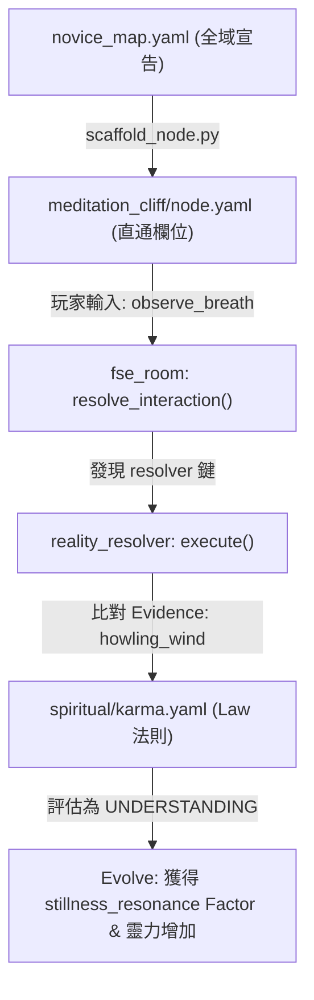

# 尋仙問道 (Shushan Odyssey) — 概念與 mudlib 實作對齊矩陣

此文件記錄了 12 篇核心大藍圖文檔（FSE 哲學、認識論、百工、因果、心魔）與當前 `mudlib` runtime 實際代碼結構的對齊狀況，並劃分出 MVP (Novice Loop) 與後期擴展的清晰邊界。

---

## 一、大藍圖概念對齊狀態矩陣

| 核心概念 | 設計文檔 | MUDLIB 實作現況 | MVP 狀態 | 後續對齊方向 |
| :--- | :--- | :--- | :--- | :--- |
| **Reality 核心 Laws** | doc 01 / 02 | `runtime/realities/spiritual/karma.yaml` ✓ `runtime/realities/natural/geology.yaml` ✓ | **已就緒 (MVP)** | 持續擴展 `social` 與 `array` 法則庫。 |
| **二代三態評估器** | doc 02 | `reality_resolver.c` (並行 Reality 評估) ✓ | **已就緒 (MVP)** | - |
| **路徑/感官直通** | doc 01 | Scaffolder 直通寫入 `node.yaml` 與 `fse_room.c` ✓ | **已就緒 (MVP)** | - |
| **Vow (自心發願)** | doc 07 | `user.c` 設有 `make_vow()` ✓ | *後期功能* | 在「紅塵集市」或「煙雨青樓」節點互動中觸發 `make_vow`。 |
| **Sutra (功法過濾)** | doc 10 | `fse_room.c` 支持 `requires_sutra` 遮罩 ✓ | *後期功能* | 建立 `sutra_factors` (如太乙陰陽經印記)，並在藏經閣拜師時解鎖。 |
| **Karmic Barriers** | doc 05 | `fse_room.c` 支持 Karma Exits 鬼打牆重定向 ✓ | *後期功能* | 在 `mountain_path` 移動時，若業力過高觸發「心雷劈頂」扣除靈力。 |
| **環境持久演化** | doc 06 | `new_signals` 寫入 observations ✓ | *後期功能* | 當前訊號是 Session 級，未來需支援節點狀態寫入 `save_state()`（如藥草被採集後的枯萎計時）。 |
| **師徒因果鏈** | doc 12 | 當前無結構 | *後期功能* | 在 `user.c` 建立 `teacher_uid` 與 `disciples` 映射，出師或欺師滅祖時影響業力。 |
| **Domain (秘境入口)** | doc 07 | 當前無結構 | *後期功能* | 在虛擬對接時，非 paths 聯通而是 Reveal 產生空間裂縫 clone 臨時 instance。 |
| **業力守護進程** | doc 07 | `user.c` heart_beat 有週期性心魔 tick ✓ | *後期功能* | 建立 `/runtime/services/karma_daemon.c` 進行全域玩家心魔天劫隨機調度。 |

---

## 二、MVP (Novice Loop) 核心跑通路徑

為了讓首個玩家能跑通最核心的「尋仙問道認識論體驗」，我們已將以下集合鎖定為 **Novice Loop 必需** 並已全部實現：

---

## 三、下一階段（後期功能）優先開發建議

當您完成 Novice Loop 體驗，準備向深度玩法進軍時，建議的開發優先級如下：

1. **Sutra (功法) 與藏經閣拜師** (優先級：高)
   * 實現功法玉簡（Item），玩家在藏經閣閱讀解鎖 `sutra:taiji_yinyang` 等 Factor。
   * 此 Factor 會動態開啟 `meditation_cliff` 等節點隱藏的「天地靈氣 (aura)」感知訊號。
2. **Karmic Barriers (因果天雷)** (優先級：中)
   * 在 `mountain_path.c` 覆寫 `on_enter()`。
   * 如果 `actor->query_karma() > 80`，在玩家移動時有機率觸發 `tell_object(actor, "天降狂雷！")` 並扣減 `spiritual_energy`，作為因果的物理阻礙。
3. **Vow (發願因果)** (優先級：中)
   * 玩家在「臨風酒館」或「紅塵當舖」觀察到凡人疾苦（獲得 observation: `mortal_suffering`），可輸入 `vow help_mortal` 發願。
   * 了結此願後，業力扣減（消業），否則隨時間產生業力衰退（Entropy）。
