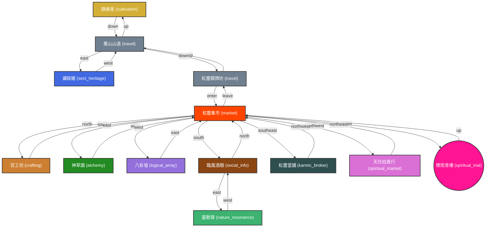

# Shushan Map Visualization (地圖可視化 - novice_map)

此文件是由 `generate_map_viz.py` 讀取 `novice_map.yaml` 後自動生成。

## 門派與紅塵地圖結構

```mermaid
graph TD
    meditation_cliff["靜慮崖 (cultivation)"]
    mountain_path["蜀山山道 (travel)"]
    sutra_pavilion["藏經閣 (sect_heritage)"]
    craft_workshop["百工坊 (crafting)"]
    herb_garden["神草園 (alchemy)"]
    array_platform["八卦壇 (logical_array)"]
    town_entrance["紅塵鎮牌坊 (travel)"]
    town_center["紅塵集市 (market)"]
    wind_tavern["臨風酒館 (social_info)"]
    pet_sanctuary["靈獸齋 (nature_resonance)"]
    destiny_pawnshop["紅塵當舖 (karmic_broker)"]
    spirit_auction["天珍拍賣行 (spiritual_market)"]
    desire_pavilion(("煙雨青樓 (spiritual_trial)"))
    meditation_cliff -->|down| mountain_path
    mountain_path -->|up| meditation_cliff
    mountain_path -->|down| town_entrance
    mountain_path -->|east| sutra_pavilion
    sutra_pavilion -->|west| mountain_path
    craft_workshop -->|south| town_center
    herb_garden -->|west| town_center
    array_platform -->|east| town_center
    town_entrance -->|up| mountain_path
    town_entrance -->|enter| town_center
    town_center -->|leave| town_entrance
    town_center -->|north| craft_workshop
    town_center -->|east| herb_garden
    town_center -->|west| array_platform
    town_center -->|south| wind_tavern
    town_center -->|southeast| destiny_pawnshop
    town_center -->|southwest| spirit_auction
    town_center -->|down| desire_pavilion
    wind_tavern -->|north| town_center
    wind_tavern -->|east| pet_sanctuary
    pet_sanctuary -->|west| wind_tavern
    destiny_pawnshop -->|northwest| town_center
    spirit_auction -->|northeast| town_center
    desire_pavilion -->|up| town_center
    style meditation_cliff fill:#d4af37,stroke:#333,stroke-width:2px,color:#fff
    style mountain_path fill:#708090,stroke:#333,stroke-width:2px,color:#fff
    style sutra_pavilion fill:#4169e1,stroke:#333,stroke-width:2px,color:#fff
    style craft_workshop fill:#cd7f32,stroke:#333,stroke-width:2px,color:#fff
    style herb_garden fill:#228b22,stroke:#333,stroke-width:2px,color:#fff
    style array_platform fill:#9370db,stroke:#333,stroke-width:2px,color:#fff
    style town_entrance fill:#708090,stroke:#333,stroke-width:2px,color:#fff
    style town_center fill:#ff4500,stroke:#333,stroke-width:2px,color:#fff
    style wind_tavern fill:#8b4513,stroke:#333,stroke-width:2px,color:#fff
    style pet_sanctuary fill:#3cb371,stroke:#333,stroke-width:2px,color:#fff
    style destiny_pawnshop fill:#2f4f4f,stroke:#333,stroke-width:2px,color:#fff
    style spirit_auction fill:#da70d6,stroke:#333,stroke-width:2px,color:#fff
    style desire_pavilion fill:#ff1493,stroke:#333,stroke-width:2px,color:#fff
```