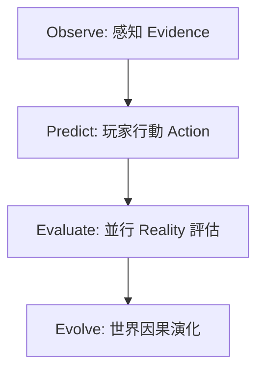

# FSE 2.0 平台開發與冒險引導指南 (Wizard Manual)

本文件是為 FSE 平台的內容創作者與系統開發者（Wizards）所編寫的技術指南。它詳細說明了 FSE 2.0 認識論引擎的核心架構，以及如何利用自動化工具鏈快速進行「宣告式世界建造」。

---

## 一、FSE 2.0 核心認識論架構

FSE 2.0 拋棄了傳統 MUD 簡單的「二元成敗」檢定，改為基於「預測與驗證」的客觀法則評估。其評估流程如下：



### 1. 並行 Reality 分支評估
一個 Predict 行動會同時在多個 Reality 面向引發不同的後果：
* **Natural Reality**：物理交互（火的蔓延、重力、岩石裂開）。
* **Social Reality**：社會倫理與人際關係。
* **Spiritual Reality**：心魔、業力與靈力共鳴。

### 2. 三態認知判定
評估的結果不會是單純的成功/失敗，而是以下三者之一：
* **UNDERSTANDING (領悟)**：玩家 Observations 與 Law 的要求完全對齊，獲得永久 Factor。
* **MISUNDERSTANDING (偏誤)**：滿足特定的誤解模式，玩家獲得局部偏誤的臨時狀態並得到提示。
* **MISCONCEPTION (成見/幻覺)**：行動與法則完全背離，引發靈力暴走或心魔鬼打牆。

---

## 二、平台自動化工具鏈

為了提升開發效率，FSE 提供了一套完整且強大的命令列工具鏈，免去手動維護繁瑣目錄結構與 LPC 代碼的負擔。

```
                    [create-adventure.py]
                             │
                             ▼
                ┌─────────────────────────┐
                │ adventures/your_game/   │
                │   ├── novice_map.yaml   │
                └────────────┬────────────┘
                             │
                             ├──────────────────────────┐
                             ▼                          ▼
                   [scaffold_node.py]         [generate_map_viz.py]
                             │                          │
                             ▼                          ▼
                     [content/nodes/]             [novice_map.svg]
```

### 1. 一鍵生成冒險模組：`create-adventure.py`
在全域根目錄下執行，快速 Bootstrap 一個全新且立即可綠燈編譯運行的冒險專案骨架：
```bash
python3 create-adventure.py --name <game_id> --title "<遊戲中文名>" --author "<作者>"
```
* **產出**：自動映射 LPC 虛擬物件規則、載入 `manifest.yaml` 與 `master.c`、為新模組配置專屬 `user.c`/`node.c`，並內建起步測試 `Makefile`。

### 2. 宣告式節點與挑戰生成：`scaffold_node.py`
在特定冒險目錄下執行，讀取全域地圖 YAML，批量或單獨生成節點、路徑聯通、挑戰 YAML 與 Locales 註冊：
```bash
# 進入您的冒險目錄
cd adventures/your_game/
# 批量編譯地圖定義檔
python3 scaffold_node.py --import_map novice_map.yaml
```
* **直通處理 (Passthrough)**：只要在地圖 YAML 中宣告，工具會自動將 `sensory_signals`、`interactions`、`presence`、`environmental_multipliers`、與 `karma_loop_threshold` 完整導出到各節點的 `node.yaml` 中，不需手動編寫。

### 3. 可視化地圖自動更新：`generate_map_viz.py`
在特定冒險目錄下執行，讀取地圖 YAML，自動生成與地圖同名的 Markdown (Mermaid) 與 SVG 向量結構圖：
```bash
python3 generate_map_viz.py novice_map.yaml
```
* **輸出**：`docs/novice_map.md` (帶色彩標註的流程圖) 與 `novice_map.svg` (方向標籤與 Reveal 虛線標註的暗色向量地圖)。

---

## 三、資料結構規範與對齊

為了讓 Runtime 穩定運行，所有 YAML 的欄位命名必須嚴格遵守以下對齊規範：

### 1. 節點定義 (`node.yaml` / `map.yaml`)
* **`paths`**：必須取代 `exits`。宣告方向到虛擬物件的聯通（例如：`down: "mountain_path"`）。
* **`desc`**：必須取代 `description` / `long`。儲存節點的中文詳細場景描述。
* **`reveal_paths`**：取代 `reveal_exits`。宣告需要 Factor 才能解鎖的隱藏路徑。

### 2. 挑戰定義 (`challenge.yaml`)
* **`evolve`**：取代 `consequence`。內部分為 `understanding`、`misunderstanding` 與 `misconception` 三個判定分支。
* **`adventure_effects`**：放置修仙/生命等屬性的數值副作用（由繼承類別的 `apply_adventure_side_effects` 解包讀取）。例如：
  ```yaml
  evolve:
    understanding:
      world_change: "actor_aligned_with_stillness"
      new_signals: ["spiritual_current_aligned"]
      adventure_effects:
        spiritual_energy: 20
        karma_change: 0
  ```

### 3. 互動宣告 (`node.yaml`) 中的門檻 (Gate) 攔截
* 當 `interaction` 含有 **`resolver`** 鍵時，`fse_room.c` 會自動將控制權移交給二代 Reality Resolver 評估。
* 如果玩家未滿足 `prerequisites`，系統會自動輸出引導性的 **`gate_msg`**（如無設定，則輸出系統預設的「心緒未定」警告），並返回 1 攔截，絕不產生沉默無效的死局。
